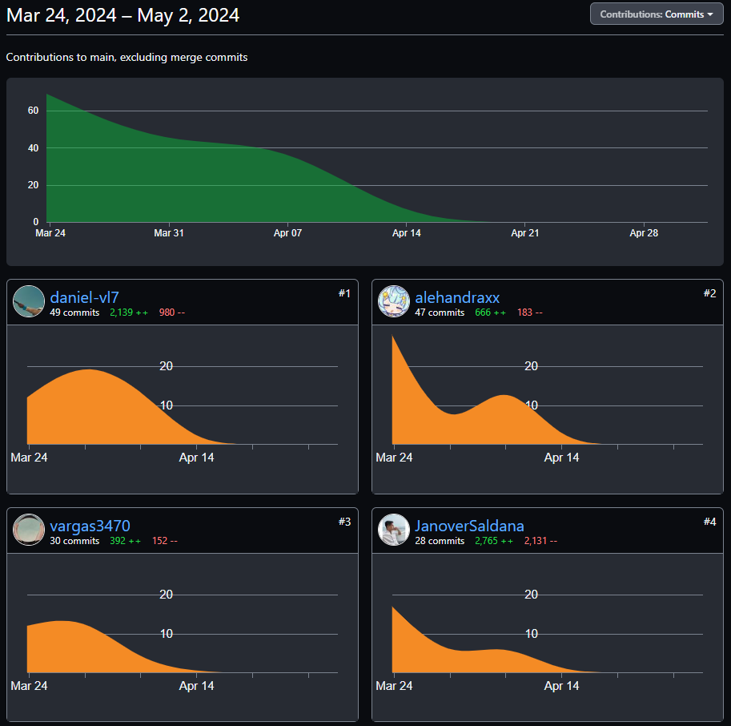
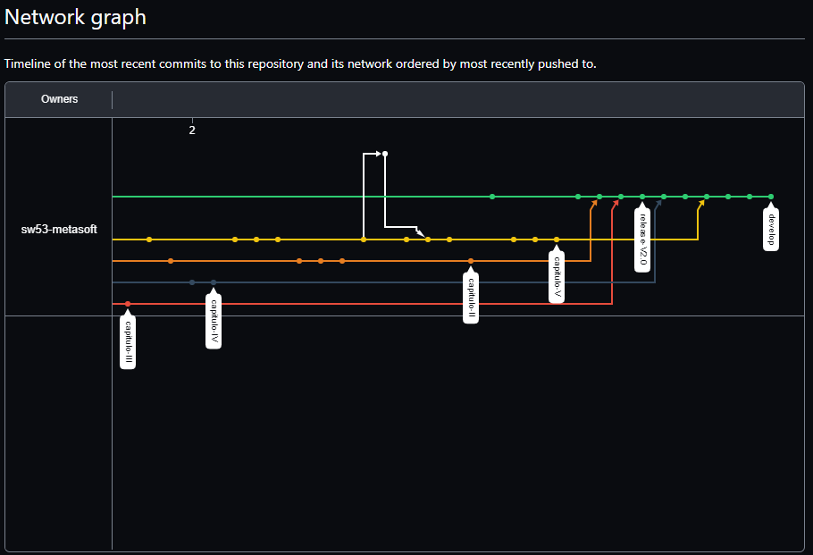
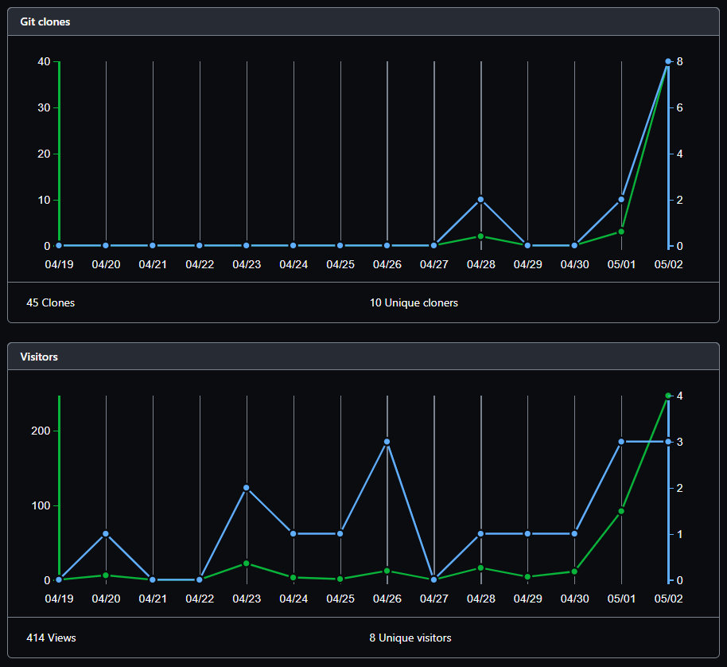

# Universidad Peruana De Ciencas Aplicadas
## Desarrollo de Aplicaciones Open Source SW53

 </img> 

# Informe Trabajo Final
## Docente: Elio Jefferrson Navarrete Vilca
## Startup: MetaSoft
## Producto: ReStyle
## Integrantes 

 
 

* **Josue Daniel Valverde Lopez     U202121440**
* **Maria Alejandra Díaz Villacrez  U202118315**
* **Janover Gonzalo Saldaña Vela    U20201B510**
* **Ariana Vargas Revollé           U20221A928** 

### 2024 - 01

---

 

## Registro de Versiones del Informe

| Versión | Fecha      | Autor                                                                          | Descripción de modificación                                                                                      |
|---------|------------|--------------------------------------------------------------------------------|------------------------------------------------------------------------------------------------------------------|
| 1.0     | 24/03/2024 | Gonzalo Saldaña                                                                | Se creo la ramificación del repositorio y adicionó los documentos en su versión inicial previa a la investigacón |
| 1.1     | 24/03/2024 | Alejandra Diaz                                                                 | Se comenzó la redacción del capítulo 1 "Introducción"                                                            |
| 1.2     | 25/03/2024 | Ariana Vargas                                                                  | Se comenzó la redacción del capítulo 2 "Requirements Elicitation & Analysis"                                     |
| 1.3     | 25/03/2024 | Gonzalo Saldaña                                                                | Continuación de la redacción del capítulo 2 "Requirements Elicitation & Analysis"                                |
| 1.4     | 28/03/2024 | Alejandra Diaz, Gonzalo Saldaña, Ariana Vargas, Daniel Valverde, Josten Huaman | Se comenzó la redacción del capítulo 3 "Requirements Specification" , redacción de historias de usuario          |
| 1.5     | 31/03/2024 | Josten Huaman                                                                  | Se comenzó la redacción del capítulo 4 "Product Design"                                                          |
| 1.6     | 31/03/2024 | Daniel Valverde                                                                | Continuación de la redacción del capítulo 4 "Product Design"                                                     |
| 1.7     | 03/04/2024 | Alejandra Diaz, Gonzalo Saldaña, Ariana Vargas, Daniel Valverde, Josten Huaman | Se comenzó la elaboración de wireframes y mockups de la aplicación del capítulo 4 "Product Design"               |
| 1.8     | 05/04/2024 | Alejandra Diaz                                                                 | Se comenzó la elaboración de wireflows del capítulo 4 "Product Design"                                           |
| 1.9     | 11/04/2024 | Alejandra Diaz, Gonzalo Saldaña, Ariana Vargas, Daniel Valverde, Josten Huaman | Se comenzó la elaboración de la landing page, documentación                                                      |
| 1.10    | 11/04/2024 | Daniel Valverde                                                                | Se comenzó la redacción del capítulo 5 "Product Implementation, Validation & Deployment"                         |
| 1.11    | 11/04/2024 | Gonzalo Saldaña                                                                | Continuación de la redacción del capítulo 5 "Product Implementation, Validation & Deployment"                    |
| 1.12    | 11/04/2024 | Ariana Vargas                                                                  | Continuación de la redacción del 5 "Product Implementation, Validation & Deployment"                             |
| 1.13    | 12/04/2024 | Alejandra Diaz, Gonzalo Saldaña, Ariana Vargas, Daniel Valverde, Josten Huaman | Finalización de items del Capítulo 5 del documento                                                               |
| 2.0     | 22/04/2024 | Daniel Valverde                                                                | Corrección de la sección Software Architecture Diagrams                                                          |
| 2.1     | 23/04/2024 | Alejandra Diaz                                                                 | Se agregó una entrevista para el segmento de contratistas                                                        |
| 2.2     | 25/04/2024 | Janover Saldaña                                                                | Corrección de las Technical Stories                                                                              |
| 2.3     | 25/04/2024 | Alejandra Diaz                                                                 | Corrección de las User Stories                                                                                   |
| 2.4     | 26/04/2024 | Daniel Valverde                                                                | Corrección de la sección Class Diagrams                                                                          |
| 2.5     | 27/04/2024 | Alejandra Diaz, Gonzalo Saldaña, Ariana Vargas, Daniel Valverde                | Se agregó la sección de Mobile Mockups, se comenzó la redacción del Sprint 2                                     |
| 2.6     | 30/04/2024 | Alejandra Diaz, Gonzalo Saldaña, Ariana Vargas, Daniel Valverde                | Continuación de la redacción del sprint 2                                                                        |
| 2.7     | 02/05/2024 | Alejandra Diaz, Gonzalo Saldaña, Ariana Vargas, Daniel Valverde                | Finalización sprint 2 del Capítulo 5                                                                             |
| 3.0     | 13/05/2024 | Daniel Valverde                                                                | Se inició la documentación del sprint 3                                                                          |
| 3.1     | 19/05/2024 | Daniel Valverde                                                                | Continuación de la redacción del sprint 3, agregando tablas para las secciones                                   |
| 3.2     | 22/05/2024 | Alejandra Diaz                                                                 | Se agregó la sección diseño de entrevistas para las validation interviews                                        |
| 3.3     | 22/05/2024 | Alejandra Diaz, Gonzalo Saldaña, Ariana Vargas, Daniel Valverde                | Se continuó la redacción del sprint 3 (sprint planning y sprint backlog)                                         |
| 3.4     | 27/05/2024 | Ariana Vargas, Alejandra Diaz                                                  | Se agregaron las evidencias de ejecución de la nueva versión de la aplicación web                                |
| 3.5     | 30/05/2024 | Daniel Valverde, Alejandra Diaz                                                | Se agregó documentación de la evaluación de heuristicas                                                          |
| 3.6     | 02/06/2024 | Daniel Valverde, Janover Saldaña                                               | Se actualizó la documentación del sprint 3                                                                       |
| 3.7     | 04/06/2024 | Ariana Vargas                                                                  | Se agregó entrevista para la sección validation interviews                                                       |
| 3.8     | 05/06/2024 | Gonzalo Saldaña                                                                | Se agregó entrevista para la sección validation interviews                                                       |
| 3.9     | 07/06/2024 | Ariana Vargas, Gonzalo Saldaña                                                 | Se agregó documentación de la evaluación de heuristicas                                                          |
| 3.10    | 08/06/2024 | Alejandra Diaz, Gonzalo Saldaña, Ariana Vargas, Daniel Valverde                | Finalización de la documentación del sprint 3                                                                    |
| 4.0     | 15/062024  | Daniel valverde                                                                | Se inicio la documentación del Sprint 4                                                                          |
| 4.1     | 17/06/2024 | Alejandra Diaz, Gonzalo Saldaña, Ariana Vargas, Daniel Valverde                | Se coordinó y redacto el contenido de las tablas de sprint planning y sprint backlog                             | 
| 4.1     | 17/06/2024 | Janover Saldaña, Daniel valverde                                               | Se docuementó las US y TS a realizar para el sprint 4                                                            | 
| 4.2     | 21/06/2024 | Alejandra Diaz                                                                 | Se agregaron evidencias de la ejecución de lo acordado en el Sprint 4                                            | 
| 4.3     | 22/06/2024 | Alejandra Diaz, Gonzalo Saldaña, Ariana Vargas, Daniel Valverde                | Se agregaron evidencias de la ejecución de la app web integrada con el BackEnd                                   | 
| 4.4     | 23/06/2024 | Alejandra Diaz, Gonzalo Saldaña, Ariana Vargas, Daniel Valverde                | DSe culminó la documentación del Sprint 4                                                                        | 

### Project Report Collaboration Insights

URL del repositorio para el reporte del proyecto: https://github.com/sw53-metasoft/ReStyle-project-report

Github Collaboration Insights proporciona un cronograma que muestra las principales ramas y los procesos de fusión que han ocurrido. Todas las ramas se han generado siguiendo los principios de GitFlow, lo que garantiza una organización efectiva al utilizar un sistema de control de versiones.

- Alejanadra Villacrez (alehandraxx)
- Daniel Valverde (daniel-vl7)
- Janover Saldaña (JanoverSaldana)
- Ariana Vargas (vargas3470)

Se divieron las siguientes ramas para la colaboración en el proyecto:

- main
- capitulo-I
- capitulo-II
- capitulo-III
- capitulo-IV
- capitulo-V
- develop

* #### Entregable TB1

A continuación se presentan los gráficos de colaboración de los integrantes del equipo en el repositorio de nuestro 
primer sprint. Estos gráficos ofrecen una representación visual de la cantidad de contribuciones realizadas por cada
miembro del equipo, junto con la fecha en que se llevaron a cabo. Además, se presenta información sobre la cantidad de 
líneas de código que se han modificado en cada uno de los commits.

</img>
</img>
</img>

* #### Entregable TP

En esta imagen, se ofrece una representación visual de las fechas en las que se llevaron a cabo cambios en el repositorio
de nuestra segundo sprint, junto con la cantidad de modificaciones realizadas en cada uno de los commits. Esta representación
gráfica es una herramienta valiosa para comprender la evolución temporal del proyecto y la intensidad del desarrollo a lo largo del tiempo.

Estos gráficos ofrecen una representación visual de las clonaciones registradas en nuestro repositorio, junto con la 
fecha en que cada una de estas acciones se llevó a cabo. Además, se presenta información sobre la cantidad de visitantes
que ha tenido el repositorio de nuestro equipo a lo largo del tiempo.

* #### Entregable TF

En esta imagen, se ofrece una representación visual de las fechas en las que se llevaron a cabo cambios en el repositorio
de nuestra segundo sprint, junto con la cantidad de modificaciones realizadas en cada uno de los commits. Esta representación
gráfica es una herramienta valiosa para comprender la evolución temporal del proyecto y la intensidad del desarrollo a lo largo del tiempo.

</img>
</img>
</img>

## Contenido 

1. [Capítulo I: Introducción](https://github.com/sw53-metasoft/ReStyle-project-report/blob/develop/docs/capitulo-I.md#cap%C3%ADtulo-i-introducci%C3%B3n)

    1.1. [Startup Profile]([/docs/capitulo-I.md#startup-profile](https://github.com/sw53-metasoft/ReStyle-project-report/blob/develop/docs/capitulo-I.md#11-startup-profile))

    1.1.1. [Descripción de la Startup](https://github.com/sw53-metasoft/ReStyle-project-report/blob/develop/docs/capitulo-I.md#112-perfiles-de-integrantes-del-equipo)

    1.1.2. [Perfiles de integrantes del equipo](https://github.com/sw53-metasoft/ReStyle-project-report/blob/develop/docs/capitulo-I.md#12-solution-profile)

    1.2. [Solution Profile]([/docs/capitulo-I.md#12-solution-profile](https://github.com/sw53-metasoft/ReStyle-project-report/blob/develop/docs/capitulo-I.md#121-antecedentes-y-problem%C3%A1tica))

    1.2.1. [Antecedentes y problemática](https://github.com/sw53-metasoft/ReStyle-project-report/blob/develop/docs/capitulo-I.md#121-antecedentes-y-problem%C3%A1tica)

    1.2.2. [Lean UX Process](https://github.com/sw53-metasoft/ReStyle-project-report/blob/develop/docs/capitulo-I.md#122-lean-ux-process)

    1.2.2.1. [Lean UX Problem Statements](https://github.com/sw53-metasoft/ReStyle-project-report/blob/develop/docs/capitulo-I.md#1221-lean-ux-problem-statements)
     
    1.2.2.2. [Lean UX Assumptions](https://github.com/sw53-metasoft/ReStyle-project-report/blob/develop/docs/capitulo-I.md#1222-lean-ux-assumptions)   

    1.2.2.3. [Lean UX Hypothesis Statements](https://github.com/sw53-metasoft/ReStyle-project-report/blob/develop/docs/capitulo-I.md#1223-lean-ux-hypothesis-statements)

    1.2.2.4. [Lean UX Canvas](https://github.com/sw53-metasoft/ReStyle-project-report/blob/develop/docs/capitulo-I.md#1224-lean-ux-canvas)

   1.3. [Segmentos Objetivo](https://github.com/sw53-metasoft/ReStyle-project-report/blob/develop/docs/capitulo-I.md#13-segmentos-objetivos)

2. [Capítulo II: Requirements Elicitation & Analysis](/docs/capitulo-II.md)
   
    2.1. [Competidores](https://github.com/sw53-metasoft/ReStyle-project-report/blob/main/docs/capitulo-II.md#21-competidores)
    
    2.1.1. [Análisis competitivo](https://github.com/sw53-metasoft/ReStyle-project-report/blob/main/docs/capitulo-II.md#211-an%C3%A1lisis-competitivo)
   
    2.1.2. [Estrategias y tácticas frente a competidores](https://github.com/sw53-metasoft/ReStyle-project-report/blob/main/docs/capitulo-II.md#212-estrategias-y-t%C3%A1cticas-frente-a-competidores)
   
    2.2. [Entrevistas](https://github.com/sw53-metasoft/ReStyle-project-report/blob/main/docs/capitulo-II.md#22-entrevistas)
   
    2.2.1. [Diseño de entrevistas](https://github.com/sw53-metasoft/ReStyle-project-report/blob/main/docs/capitulo-II.md#221-diseño-de-entrevistas)
   
    2.2.2. [Registro de entrevistas](https://github.com/sw53-metasoft/ReStyle-project-report/blob/main/docs/capitulo-II.md#222-registro-de-entrevistas)
   
    2.2.3. [Análisis de entrevistas](https://github.com/sw53-metasoft/ReStyle-project-report/blob/main/docs/capitulo-II.md#223-analisis-de-entrevistas)
    
    2.3. [Needfinding](https://github.com/sw53-metasoft/ReStyle-project-report/blob/main/docs/capitulo-II.md#23-needfinding)
    
    2.3.1. [User Personas](https://github.com/sw53-metasoft/ReStyle-project-report/blob/main/docs/capitulo-II.md#231-user-personas)
    
    2.3.2. [User Task Matrix](https://github.com/sw53-metasoft/ReStyle-project-report/blob/main/docs/capitulo-II.md#232-user-task-matrix)
    
    2.3.3. [User Journey Mapping](https://github.com/sw53-metasoft/ReStyle-project-report/blob/main/docs/capitulo-II.md#233-user-journey-mapping)
    
    2.3.4. [Empathy Mapping](https://github.com/sw53-metasoft/ReStyle-project-report/blob/main/docs/capitulo-II.md#234-empathy-mapping)
    
    2.3.5. [As-is Scenario Mapping](https://github.com/sw53-metasoft/ReStyle-project-report/blob/main/docs/capitulo-II.md#235-as-is-scenario-mapping)
    
    2.4. [Ubiquitous Language](https://github.com/sw53-metasoft/ReStyle-project-report/blob/main/docs/capitulo-II.md#24-ubiquitous-language)

3. [Capítulo III: Requirements Specification](/docs/capitulo-III.md)

    3.1. [To-Be Scenario Mapping](/docs/capitulo-III.md#31-to-be-scenario-mapping)

    3.2. [User Stories](https://github.com/sw53-metasoft/ReStyle-project-report/blob/main/docs/capitulo-III.md#32-user-stories)
   
    3.3. [Impact Mapping](/docs/capitulo-III.md#33-impact-mapping)
   
    3.4. [Product Backlog](/docs/capitulo-III.md#34-product-backlog)

4. [Capítulo IV: Product Design](/docs/capitulo-IV.md)

    4.1. [Style Guidelines](/docs/capitulo-IV.md#41-style-guidelines-)

    4.1.1. [General Style Guidelines](/docs/capitulo-IV.md#411-general-style-guidelines)

    4.1.2. [Web Style Guidelines](/docs/capitulo-IV.md#412-web-style-guidelines)

    4.2. [Information Architecture](/docs/capitulo-IV.md#42-information-architecture)

    4.2.1. [Organization Systems](/docs/capitulo-IV.md#421-organization-systems)

    4.2.2. [Labeling Systems](/docs/capitulo-IV.md#422-labeling-systems)

    4.2.3. [SEO Tags and Meta Tags](/docs/capitulo-IV.md#423-seo-tags-and-meta-tags)

    4.2.4. [Searching Systems](/docs/capitulo-IV.md#424-searching-systems)

    4.2.5. [Navigation Systems](/docs/capitulo-IV.md#425-navigation-systems)

    4.3. [Landing Page UI Design](/docs/capitulo-IV.md#43-landing-page-ui-design)

    4.3.1. [Landing Page Wireframe](/docs/capitulo-IV.md#431-landing-page-wireframe)

    4.3.2. [Landing Page Mock-up](/docs/capitulo-IV.md#432-landing-page-mock-up)

    4.4. [Web Applications UX/UI Design](/docs/capitulo-IV.md#44-web-applications-uxui-design)

    4.4.1. [Web Applications Wireframes](/docs/capitulo-IV.md#441-web-applications-wireframes)

    4.4.2. [Web Applications Wireflow Diagrams](/docs/capitulo-IV.md#442-web-applications-wireflow-diagrams)

    4.4.3. [Web Applications Mock-ups](https://github.com/sw53-metasoft/ReStyle-project-report/blob/main/docs/capitulo-IV.md#443-web-applications-user-flow-diagrams)

    4.4.4. [Web Applications User Flow Diagrams](/docs/capitulo-IV.md#444-web-applications-user-flow-diagrams)

    4.5. [Web Applications Prototyping](/docs/capitulo-IV.md#45-web-applications-prototyping)

    4.6. [Domain-Driven Software Architecture](/docs/capitulo-IV.md#46-domain-driven-software-architecture)

    4.6.1. [Software Architecture Context Diagram](/docs/capitulo-IV.md#461-software-architecture-context-diagram)

    4.6.2. [Software Architecture Container Diagrams](/docs/capitulo-IV.md#462-software-architecture-container-diagrams)

    4.6.3. [Software Architecture Components Diagrams](/docs/capitulo-IV.md#463-software-architecture-components-diagrams)

    4.7. [Software Object-Oriented Design](/docs/capitulo-IV.md#47-software-object-oriented-design)

    4.7.1. [Class Diagrams](/docs/capitulo-IV.md#471-class-diagrams)

    4.7.2. [Class Dictionary](/docs/capitulo-IV.md#472-class-dictionary)

    4.8. [Database Design](/docs/capitulo-IV.md#48-database-design)

    4.8.1. [Database Diagram](/docs/capitulo-IV.md#481-database-diagram)

5. [Capítulo V: Product Implementation, Validation & Deployment](/docs/capitulo-V.md)

    5.1. [Software Configuration Management](/docs/capitulo-V.md#51-software-configuration-management-)

    5.1.1. [Software Development Environment Configuration](/docs/capitulo-V.md#511-software-development-environment-configuration)

    5.1.2. [Source Code Management](/docs/capitulo-V.md#512-source-code-management)

    5.1.3. [Source Code Style Guide & Conventions](/docs/capitulo-V.md#513-source-code-style-guide-&-conventions)

    5.1.4. [Software Deployment Configuration](/docs/capitulo-V.md#514-software-deployment-configuration)

    5.2. [Landing Page, Services & Applications Implementation](https://github.com/sw53-metasoft/ReStyle-project-report/blob/main/docs/capitulo-V.md#52-landing-page-services--applications-implementation)

    5.2.1. [Sprint 1](/docs/capitulo-V.md#521-sprint-1)

    5.2.1.1. [Sprint Planning 1](/docs/capitulo-V.md#5211-sprint-planning-1)

    5.2.1.2. [Sprint Backlog 1](/docs/capitulo-V.md#5212-sprint-backlog-1)

    5.2.1.3. [Development Evidence for Sprint Review](/docs/capitulo-V.md#5213-development-evidence-for-sprint-review)

    5.2.1.4. [Testing Suite Evidence for Sprint Review](/docs/capitulo-V.md#5214-testing-suite-evidence-for-sprint-review)

    5.2.1.5. [Execution Evidence for Sprint Review](/docs/capitulo-V.md#5215-execution-evidence-for-sprint-review)

    5.2.1.6. [Services Documentation Evidence for Sprint Review](/docs/capitulo-V.md#5216-services-documentation-evidence-for-sprint-review)

    5.2.1.7. [Software Deployment Evidence for Sprint Review](/docs/capitulo-V.md#5217-software-deployment-evidence-for-sprint-review)

    5.2.1.8. [Team Collaboration Insights during Sprint](/docs/capitulo-V.md#5218-team-collaboration-insights-during-sprint)

   5.2.2. [Sprint 2](/docs/capitulo-V.md#522-sprint-2)

   5.2.2.1. [Sprint Planning 2.](/docs/capitulo-V.md#5221-sprint-planning-2)

   5.2.2.2. [Sprint Backlog 2.](/docs/capitulo-V.md#5222-sprint-backlog-2)

   5.2.2.3. [Development Evidence for Sprint Review.](/docs/capitulo-V.md#5223-development-evidence-for-sprint-review)

   5.2.2.4. [Testing Suite Evidence for Sprint Review.](/docs/capitulo-V.md#5224-testing-suite-evidence-for-sprint-review)

   5.2.2.5. [Execution Evidence for Sprint Review.](/docs/capitulo-V.md#5225-execution-evidence-for-sprint-review)

   5.2.2.6. [Services Documentation Evidence for Sprint Review.](/docs/capitulo-V.md#5226-services-documentation-evidence-for-sprint-review)

   5.2.2.7. [Software Deployment Evidence for Sprint Review.](/docs/capitulo-V.md#5227-software-deployment-evidence-for-sprint-review)

   5.2.2.8. [Team Collaboration Insights during Sprint.](/docs/capitulo-V.md#5228-team-collaboration-insights-during-sprint)

   5.2.3. [Sprint 3](/docs/capitulo-V.md#523-sprint-3)

    5.2.3.1. [Sprint Planning 3.](/docs/capitulo-V.md#5231-sprint-planning-3)
    
    5.2.3.2. [Sprint Backlog 3.](/docs/capitulo-V.md#5232-sprint-backlog-3)
    
    5.2.3.3. [Development Evidence for Sprint Review.](/docs/capitulo-V.md#5233-development-evidence-for-sprint-review-)
    
    5.2.3.4. [Testing Suite Evidence for Sprint Review.](/docs/capitulo-V.md#5234-testing-suite-evidence-for-sprint-review-)
    
    5.2.3.5. [Execution Evidence for Sprint Review.](/docs/capitulo-V.md#5235-execution-evidence-for-sprint-review-)
    
    5.2.3.6. [Services Documentation Evidence for Sprint Review.](/docs/capitulo-V.md#5236-services-documentation-evidence-for-sprint-review-)
    
    5.2.3.7. [Software Deployment Evidence for Sprint Review.](/docs/capitulo-V.md#5237-software-deployment-evidence-for-sprint-review)
    
    5.2.3.8. [Team Collaboration Insights during Sprint.](/docs/capitulo-V.md#5238-team-collaboration-insights-during-sprint)

   5.2.4. [Sprint 4](/docs/capitulo-V.md#524-sprint-4)

    5.2.4.1. [Sprint Planning 4.](/docs/capitulo-V.md#5241-sprint-planning-4)
    
    5.2.4.2. [Sprint Backlog 4.](/docs/capitulo-V.md#5242-sprint-backlog-4)
    
    5.2.4.3. [Development Evidence for Sprint Review.](/docs/capitulo-V.md#5243-development-evidence-for-sprint-review)
    
    5.2.4.4. [Testing Suite Evidence for Sprint Review.](/docs/capitulo-V.md#5244-testing-suite-evidence-for-sprint-review)
    
    5.2.4.5. [Execution Evidence for Sprint Review.](/docs/capitulo-V.md#5245-execution-evidence-for-sprint-review)
    
    5.2.4.6. [Services Documentation Evidence for Sprint Review.](/docs/capitulo-V.md#5246-services-documentation-evidence-for-sprint-review)
    
    5.2.4.7. [Software Deployment Evidence for Sprint Review.](/docs/capitulo-V.md#5247-software-deployment-evidence-for-sprint-review)
    
    5.2.4.8. [Team Collaboration Insights during Sprint.](/docs/capitulo-V.md#5248-team-collaboration-insights-during-sprint)

    5.3. [Validation Interviews](/docs/capitulo-V.md#53-validation-interviews)

    5.3.1. [Diseño de Entrevistas](/docs/capitulo-V.md#531-diseño-de-entrevistas)

    5.3.2. [Registro de Entrevistas](/docs/capitulo-V.md#532-registro-de-entrevistas)

    5.3.3. [Evaluaciones según heurísticas](/docs/capitulo-V.md#533-evaluaciones-según-heurísticas)

    5.4. [Video About-the-Product](/docs/capitulo-V.md#54-video-about-the-product)

6. [Conclusiones](/docs/capitulo-V.md#conclusiones)
7. [Bibliografía](/docs/capitulo-V.md#bibliografía)
8. [Anexos](/docs/capitulo-V.md#anexos)
 

## Student Outcome

<table>
  <thead>
    <tr>
      <th>Vriterio especifico</th>
      <th>Acciones realizadas</th>
      <th>conclusiones</th>
    </tr>
  </thead>
  <tbody>
    <tr>
     <!--PRIMER CRITERIO DE STUDENT OUTCOME-->
      <td rowspan="17">
        Comunica oralmente sus ideas
        y/o resultados con objetividad a
        público de diferentes
        especialidades y niveles
        jerarquicos, en el marco del
        desarrollo de un proyecto en
        ingeniería
      </td>
       <!--ENTREGA TB1-->
      <!-- Estudiante 1 TB1 -->    
      <td>
        <b>Díaz Villacrez, María Alejandra TB1:</b> 
        Colaboré en la recolección de requisitos para satisfacer la entrega del trabajo. Proporcioné contexto sobre el problema de negocio y las necesidades que se desean satisfacer. Identificamos los segmentos objetivos y utilicé gráficos para representar la información de manera visual y comprensible. </td>
        <td rowspan="5"> 
         <b>CONCLUSIÓN DEL ENTREGABLE TB1</b> 
         Al aplicar una organización correcta pudimos comunicar nuestras ideas de negocio y resultados de manera objetiva y efectiva a una audiencia diversa en el contexto de un proyecto de ingeniería de software.
      </td>   
    </tr>
    <!-- Estudiante 2 TB1 --> 
    <tr> 
      <td>
      <b>Valverde Lopez, Josue Daniel TB1:</b>   
      Se realizaron entrevistas a los segmentos objetivo para entender los requisitos. A partir del análisis de las entrevistas se elaboró las historias de usuario tomando en cuenta los requisitos de los segmentos.  
    </td>   
    </tr>
    <!-- Estudiante 3 TB1-->
     <tr>   
      <td>
        <b>Janover Gonzalo Saldaña Vela TB1:</b> 
        Comunicar nuestras ideas jugó un rol importante para identificar una problemática y plantear un salucion para ello.
      </td>    
    </tr>
    <!-- Estudiante 4 TB1-->
     <tr>   
      <td>
      <b>Vargas Revollé, Ariana TB1:</b> 
       Se realizaron User Stories sobre la funcionalidad de la applicacion asi como la elaboracion de user personas y los mapas requeridos para la comprension de los segmentos objetivos</td>   
    </tr>
    <!-- Estudiante 5 TB1-->
    <tr>   
      <td>
        <b>Huaman Bellido, Josten Marc TB1:</b> 
        contribuí al proyecto realizando el diseño del producto con sus características distintivas. Esto implicó traducir los requisitos recopilados y las historias de usuario en un diseño funcional y atractivo. Me aseguré de que el diseño reflejara las necesidades y preferencias de los segmentos objetivo, mientras mantenía la usabilidad y la estética del producto.
      </td>   
    <!--ENTREGA TRABAJO PARCIAL-->
    <!-- ESTUDIANTE 1 TP --> 
    <tr> 
      <td> 
        <b>Díaz Villacrez, María Alejandra TP:</b> 
        Pudimos identificar el MVP para el sprint 2 en nuestras reuniones y asegurarnos que el core business de nuestro producto este implementado. Ademas, se realizaron lluvias de ideas en equipo para completar el alance de la entrega del trabajo parcial.
      </td> 
      <td rowspan="4">
        <b>CONCLUSIÓN DEL ENTRGABLE TP</b> 
        Al aplicar una organización correcta durante nuestro sprint 2 pudimos comunicar nuestras ideas de negocio y resultados de manera objetiva y efectiva. De igual manera, nos sirvio como experiencia en grupo para identificar objetivos del software.
      </td>   
    </tr>
    <!-- ESTUDIANTE 2 TP --> 
    <tr> 
      <td> 
        <b>Valverde Lopez, Josue Daniel TP:</b> 
        Se coordinaron reuniones con el equipo para mantenernos al tanto de los progresos continuos durante el sprint. Asimismo, creamos un video de presentación que resume lo logrado durante el segundo sprint.
      </td>   
    </tr>
    <!-- ESTUDIANTE 3 Tp-->
     <tr>   
      <td>
        <b>Saldaña Vela Janover Gonzalo TP: </b> 
        Se marcaron roles en la organización del equipo para poder tener una mejor flujo de trabajo al momento de realizar nuestras asignaciones, asi mismo, reportar las incidencias y la predisposicion del equipo para ayudar a resolverlos durante el desarrollo del sprint 2 nos ayudo mucho a aprender unos de otros y concretar con exito el sprint mencionado.
      </td>   
    </tr>
    <!-- ESTUDIANTE 4 Tp-->
     <tr>   
      <td><b>Vargas Revollé, Ariana  TP: </b> 
        Se hizo seguimiento al proyecto realizado mediate reuniones realizadas durante el avance.
      </td>     
    </tr>
     <!--ENTREGA TB2-->
    <!-- ESTUDIANTE 1 TB2 --> 
    <tr> 
      <td> 
        <b>Díaz Villacrez, María Alejandra TB2:</b> 
         Realice entrevistas de validacion para los segmentos objetivos de nuestra solucion. Realice el despliegue de la base de datos MySQL.
      </td> 
      <td rowspan="4">
        <b>CONCLUSIÓN DEL ENTRGABLE TB2</b> 
        Se completo el alcance del Sprint 3 para la entrega, se lograron identificar los bounded contexts para luego elaborar el desarrollo de las technical stories.
      </td>   
    </tr>
    <!-- ESTUDIANTE 2 TB2 --> 
    <tr> 
      <td> 
        <b>Valverde Lopez, Josue Daniel TB2:</b> 
        Realicé entrevistas de validación con los segmentos objetivos para obtener retroalimentación y priorizar los requisitos según las indicaciones de los clientes. 
      </td>   
    </tr>
    <!-- ESTUDIANTE 3 TB2-->
     <tr>   
      <td>
        <b>Saldaña Vela Janover Gonzalo TB2: </b> 
        Realicé entrevistas de validación para analizar el proceso en el que se encuentra nuestro software e intervenir en caso nuestros segmentos objetivos encuentren demasiados inconvenientes con respecto a su uso.
      </td>   
    </tr>
    <!-- ESTUDIANTE 4 TB2-->
     <tr>   
      <td><b>Vargas Revollé, Ariana  TB2: </b> 
        Se realizaron entrevistas de validacion para poder evaluar la respuesta del segmento al producto y posibles faltas en heuristicas que el entrevistado pueda percibir
      </td>     
    </tr>
    <!--ENTREGA TF-->
    <!-- ESTUDIANTE 1 TF --> 
    <tr> 
      <td> 
        <b>Díaz Villacrez, María Alejandra TF:</b> 
         Realice validaciones del frontend y backend de la aplicacion, pude desplegar ambas exitosamente y completar los servicios de nuestro proyecto.
      </td> 
      <td rowspan="4">
        <b>CONCLUSIÓN DEL ENTRGABLE TF</b> 
       Gracias a lo desarrollado durante este ultimo sprint, como grupo fuimos capaces de solucionar los problemas que aparecieron durante el control de versiones de nuestro codigo y la comunicacion fue clara para abordar cualquier malentendido durante el ciclo de vida del proyecto.
      </td>   
    </tr>
    <!-- ESTUDIANTE 2 TF --> 
    <tr> 
      <td> 
        <b>Valverde Lopez, Josue Daniel TF:</b> 
        Realice los despliegues del frontend y backend, pude implementar los bounded context de iam en el backend. Investigue sobre las tecnologias de Java y OpenApi.
      </td>   
    </tr>
    <!-- ESTUDIANTE 3 TF-->
     <tr>   
      <td>
      <b>Saldaña Vela Janover Gonzalo TF: </b> 
        Se mantuvo un orden de jerarquia y asignaciones de tareas para una mejor coordinación de los diferentes aspectos del desarrollo del proyecto, tan para la parte de FrontEnd y BackEnd.
      </td>   
    </tr>
    <!-- ESTUDIANTE 4 TF-->
     <tr>   
      <td><b>Vargas Revollé, Ariana  TF: </b> 
        Se distribuyeron las actividades pendientes para la conclusion del proyecto ReStyle y fue este concluido hasta el alcanze  deseado
      </td>     
    </tr>
    <!--SEGUNDO CRITERIO DE STUDENT OUTCOME-->
    <tr>
      <td rowspan="17">
        Comunica en forma escrita ideas
        y/o resultados con objetividad a
        público de diferentes
        especialidades y niveles
        jerarquicos, en el marco del
        desarrollo de un proyecto en
        ingeniería..
      </td>
      <!-- Estudiante 1 -->    
      <td>
        <b>Díaz Villacrez, María Alejandra TB1:</b> 
        Presenté información necesaria para respaldar las estadísiticas y citas proporcionadas en la primera entrega del trabajo. Definí términos técnicos importantes utilizados en el informe.
      </td> 
      <td rowspan="5">
        <b>CONCLUSIÓN DEL ENTREGABLE TB1:</b> 
        Al guiarnos en las indicaciones del trabajo final pudimos comunicar de manera escrita nuestros resultados luego de un analisis previo exhaustivo.
      </td>    
    </tr>
    <!-- Estudiante 2 --> 
    <tr> 
      <td>
        <b>Valverde Lopez, Josue Daniel TB1:</b> 
        Realicé los diagramas de Contexto, contenedores y componentes en fase inicial tomando en cuenta el lenguaje obicuo el cual permite el entendimiento a los segmentos objetivo.
      </td>   
    </tr>
    <!-- Estudiante 3-->
     <tr>   
      <td>
        <b>Janover Gonzalo Saldaña Vela TB1:</b> 
        Comunicar nuestras ideas jugó un rol importante para identificar una problemática y plantear un salucion para ello.
      </td>    
    </tr>
    <!-- Estudiante 4-->
     <tr>   
      <td>
        <b>Vargas Revollé, Ariana TB1:</b> 
        Se contribuyo con el landing page del Startup y documento los aportes de los integrantes del equipo
      </td>    
    </tr>
    <!-- Estudiante1 5-->
     <tr>   
      <td>
        <b>Huaman Bellido, Josten Marc TB1:</b> 
        Desarrollé las pautas de estilo que garantizaban coherencia y uniformidad en la presentación de la información. Estas directrices ayudaron a mantener un estándar visual y de comunicación consistente en todo el trabajo, facilitando así la comprensión y el seguimiento por parte de los usuarios.
      </td>     
    </tr>
    <!--ENTREGA TRABAJO PARCIAL-->
    <!-- ESTUDIANTE 1 TP --> 
    <tr> 
      <td> 
        <b>Díaz Villacrez, María Alejandra TP:</b> 
        Correji las historias de usuario e identificamos el MVP para nuestro core business. De igual manera, se analizaron los bounded context para repartirlos en features para nuestro frontend.
      </td> 
      <td rowspan="4">
        <b>CONCLUSIÓN DEL ENTRGABLE TP</b> 
        Para esta entrega, se evaluaron distintos objetivos para nuestros dos segmentos objetivos en la elaboracion de nuestro reporte. Se pudieron desarrollar de manera colaborativa los features de nuestro core business.
      </td>   
    </tr>
    <!-- ESTUDIANTE 2 TP --> 
    <tr> 
      <td> 
        <b>Valverde Lopez, Josue Daniel TP:</b> 
        Desarrollé vistas para la sección de contratistas de la aplicación web. Además, documenté el sprint backlog 2, el cual fue agregado en trello para  observar el progreso de elaboración de las funcionalidades del proyecto
      </td>   
    </tr>
    <!-- ESTUDIANTE 3 tp-->
     <tr>   
      <td>
        <b>Saldaña Vela Janover Gonzalo TP: </b> 
        Apoyé en la correción de la redacción de technicals stories, desarrollo vistas para ambos segmentos objetivos identificados por el equipo y documenté los mismos para compartirlo con mis compañeros de equipo.
      </td>   
    </tr>
    <!-- ESTUDIANTE 4 tp-->
     <tr>   
      <td><b>Vargas Revollé, Ariana  TP: </b> 
        Se levantaron observaciones hechas en la primera entrega y se programaron las vistas necesarias para el sprint 2
      </td>     
    </tr>
     <!--ENTREGA TB2-->
    <!-- ESTUDIANTE 1 TB2 --> 
    <tr> 
      <td> 
        <b>Díaz Villacrez, María Alejandra TB2:</b> 
         Desarrollo y correccion de technical stories de acuerdo a nuestros bounded context y Video About the product.
      </td> 
      <td rowspan="4">
        <b>CONCLUSIÓN DEL ENTRGABLE TB2</b> 
        Se completo el desarrollo del backend de nuestra aplicacion, ademas de un despliegue correcto de la base de datos en la nube.
      </td>   
    </tr>
    <!-- ESTUDIANTE 2 TB2 --> 
    <tr> 
      <td> 
        <b>Valverde Lopez, Josue Daniel TB2:</b> 
         Gestioné el sprint backlog del sprint 3 y organicé el sprint en Jira para la documentación 
      </td>   
    </tr>
    <!-- ESTUDIANTE 3 TB2-->
     <tr>   
      <td>
        <b>Saldaña Vela Janover Gonzalo TB2: </b> 
        Durante el desarrollo del TB2 colaboré en la docuemntación de de algunos items del capitulo V y el video de about the team.
      </td>   
    </tr>
    <!-- ESTUDIANTE 4 TB2-->
     <tr>   
      <td><b>Vargas Revollé, Ariana  TB2: </b> 
       Se desarolló parcialemente un bounded context necesario para el backend de la aplicacion en desarrollo
      </td>     
    </tr>
    <!--ENTREGA TF-->
    <!-- ESTUDIANTE 1 TF --> 
    <tr> 
      <td> 
        <b>Díaz Villacrez, María Alejandra TF:</b> 
         Durante el desarrollo del trabajo final, colabore en la continuacion de mejoras del backend y frontend, pudiendo juntar ambos para el despliegue de la aplicacion.
      </td> 
      <td rowspan="4">
        <b>CONCLUSIÓN DEL ENTRGABLE TF</b> 
       Gracias a lo desarrollado durante este ultimo sprint, pudimos como grupo tener un mejor entendimiento de ambas capas de front y back end de las aplicaciones open source.
      </td>   
    </tr>
    <!-- ESTUDIANTE 2 TF --> 
    <tr> 
      <td> 
        <b>Valverde Lopez, Josue Daniel TF:</b> 
        Desarrolle los bounded contexts planteados en el sprint 4, pude completar los requisitos para cerrar el ciclo de vida del proyecto. 
      </td>   
    </tr>
    <!-- ESTUDIANTE 3 TF-->
     <tr>   
      <td>
      <b>Saldaña Vela Janover Gonzalo TF: </b> 
        Se conclusión con la correción de estilos, y componentes que mejoren la experiencia de usuario del FrontEnd de la aplicación web, según especificación de la auditoria y recomendaciones de nuestros segmentos objetivos.
      </td>   
    </tr>
    <!-- ESTUDIANTE 4 TF-->
     <tr>   
      <td><b>Vargas Revollé, Ariana  TF: </b> 
        Se concluyo el desarrollo de el Front-End de la aplicacion con secciones personalizadas para cada tipo de usuario considerado segun el parametro de mejora continua, de igual menara se trabajo en el video About-the-product
      </td>     
    </tr>
</table>

